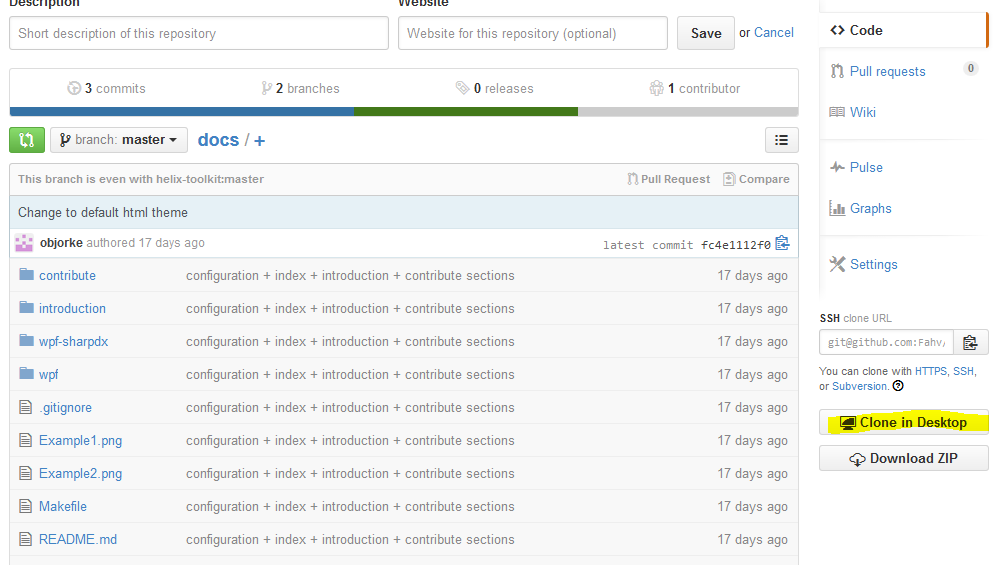

======================
Documentation Tutorial
======================
.. note:: This section is under construction. Please contribute!

Getting the Documentation
=========================

1. Go to `<https://github.com/helix-toolkit/docs>`_
	a. Sign in or create an account
2. Fork the docs repository located on the top right

.. image:: documentation-tutorial-images/Fork.png

3. After this completes go to your newly forked repository
	a. The url will be something like :samp:`https://github.com/{UserName}/docs`
4. Click the Clone in Desktop button on the right hand side
	a. A GitHub client needs to be installed on your computer. More information on how to install one is located `here (Windows) <https://windows.github.com/>`_ or `here (Mac) <https://mac.github.com/>`_.
	

Building the Documentation
==========================

Navigating
==========

Making your changes
===================

Publishing your changes
=========================