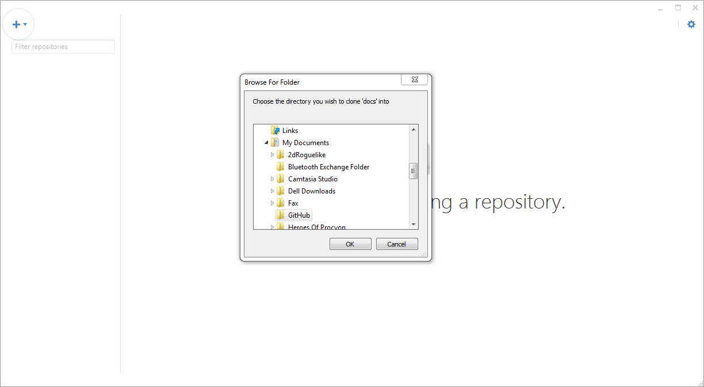

======================
Documentation Tutorial
======================
.. note:: This section is under construction. Please contribute!

Getting the Documentation
=========================

1. Go to `<https://github.com/helix-toolkit/docs>`_
	a. Sign in or create an account
2. Fork the docs repository located on the top right

.. image:: documentation-tutorial-images/Fork.png

3. After this completes go to your newly forked repository
	a. The url will be something like :samp:`https://github.com/{UserName}/docs`
4. Click the Clone in Desktop button on the right hand side
	a. A GitHub client needs to be installed on your computer. More information on how to install one is located `here (Windows) <https://windows.github.com/>`_ or `here (Mac) <https://mac.github.com/>`_.
	
.. image:: documentation-tutorial-images/CloneinDesktop.PNG

5.  Select where you want the repository to be stored on your computer

6. Congratulations the documentation is now on your local computer

Building the Documentation
==========================
1. Go to `<https://www.python.org/downloads/>`_ and download Python 2.7.10
2. Install Python 2.7.10
3. Go to `<https://pypi.python.org/pypi/setuptools>`_ and get setuptools 17.0
	a. Lots of documentation on that site on how to install
4. Open the cmd as an administrator
	a. Right click run as administrator
	
.. image:: documentation-tutorial-images/cmd.png

5. Type the command easy_install -U Sphinx
6. Hit the enter key

.. image:: documentation-tutorial-images/easy_install-USphinx.png

7. Navigate to the folder where you put your documentation

8. Run the make html.cmd file

.. image:: documentation-tutorial-images/makehtmlcmd.png

9. Congratulations the documentation is now built on your computer and you can navigate to the newly created _build folder to check it out.

Making your changes
===================
1. First find something that requires fixing
	a. Some examples are:
		* Fixing spelling errors
		* Check the issue list `<https://github.com/helix-toolkit/docs/issues>_
		* Write a tutorial
2. Open the corresponding page.rst file
3. Make your changes
4. Run the make html.cmd file
	a. Make sure no warnings
5. Check out your changes in the browser

Publishing your changes
=========================